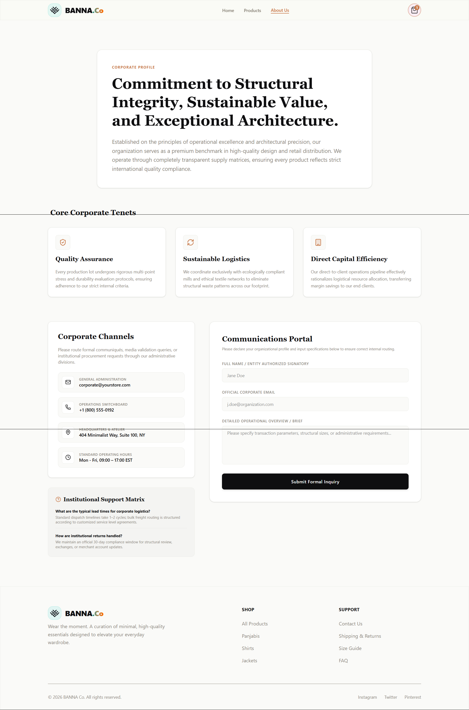
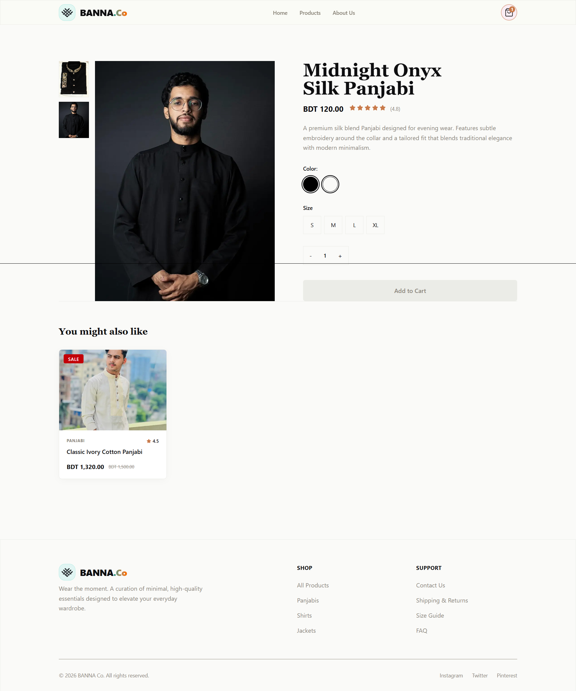
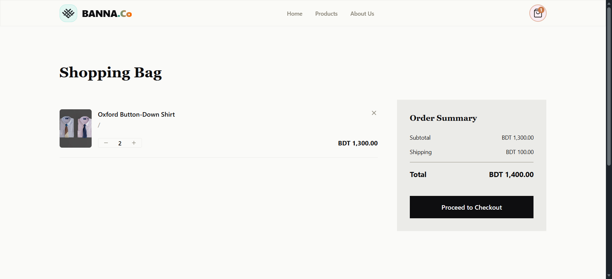

# BANNA Co. — Fashion Store Frontend

A modern, frontend-only fashion e-commerce storefront — built as a hands-on take-home task to demonstrate real-world frontend engineering: clean architecture, client-side state, responsive design, and attention to UI polish. All data is local/static; there is no backend, database, or authentication.

**🔗 Live Demo:** [banna-co-fashion.vercel.app](https://banna-co-fashion.vercel.app/)
**📦 Repository:** [github.com/nmjakaria/banna-co-fashion-store](https://github.com/nmjakaria/banna-co-fashion-store)

---

## Table of Contents

- [About the Project](#about-the-project)
- [Tech Stack](#tech-stack)
- [Features](#features)
- [Pages Overview](#pages-overview)
- [Getting Started](#getting-started)
- [Folder Structure](#folder-structure)
- [Design Decisions](#design-decisions)
- [Screenshots](#screenshots)
- [Known Limitations](#known-limitations)
- [Author](#author)

---

## About the Project

**BANNA Co.** is a fictional fashion brand storefront designed and built to showcase how a real customer would browse products, filter by category, view product details, and manage a shopping cart — entirely on the frontend. The brand identity (name, palette, typography, and layout) was designed from scratch with a minimal, editorial aesthetic in mind, inspired by South Asian textile craftsmanship (the name nods to *baana*, the weft thread in traditional weaving).

The goal of this project was not just to satisfy the functional checklist, but to build something that feels like a real, production-quality storefront — clean component architecture, thoughtful loading/empty states, and no rough edges across screen sizes.

---

## Tech Stack

| Category | Choice |
|---|---|
| Framework | [Next.js 14](https://nextjs.org/) (App Router) |
| Language | JavaScript (no TypeScript) |
| Styling | [Tailwind CSS](https://tailwindcss.com/) + [DaisyUI](https://daisyui.com/) |
| State Management | React Context API + `useReducer` (cart), persisted to `localStorage` |
| Animation | [Framer Motion](https://www.framer.com/motion/) |
| Icons | [Lucide React](https://lucide.dev/) |
| Notifications | [React Hot Toast](https://react-hot-toast.com/) |
| Deployment | [Vercel](https://vercel.com/) |
| Images | Unsplash / Pexels (dummy product photography) |

---

## Features

**Core**
- Fully responsive layout — flawless across mobile, tablet, and desktop breakpoints
- Client-side routing across all pages via the Next.js App Router
- Global cart state via Context + `useReducer`, persisted across page refresh
- Loading states (skeletons, route-level loading UI) and empty states (empty cart, empty filter results, custom 404)
- Modular, reusable component architecture — no page contains raw section markup

**Bonus**
- Live search across products
- Sort by price (ascending/descending)
- Category filtering with URL query param support (shareable filtered links)
- Skeleton loaders on simulated data fetch
- Quantity controls with live subtotal recalculation
- Mini-cart slide-over drawer with Framer Motion transitions
- Micro-interactions across hero, cards, and buttons

---

## Pages Overview

| Page | Route | Description |
|---|---|---|
| Home | `/` | Hero banner, category strip, featured products, promo banner, testimonials, newsletter signup |
| Products | `/products` | Full catalog in a responsive grid, with category filter, search, and price sort |
| Product Details | `/products/[id]` | Image gallery, color/size selectors, quantity stepper, add-to-cart, related products |
| Cart | `/cart` | Cart items with quantity controls, live subtotal, order summary, empty state |
| About | `/about` | Brand story, values, and a contact form |

---

## Getting Started

Clone the repository and run it locally:

```bash
git clone https://github.com/nmjakaria/banna-co-fashion-store.git
cd banna-co-fashion-store
npm install
npm run dev
```

Then open [http://localhost:3000](http://localhost:3000) in your browser.

**Build for production:**

```bash
npm run build
npm start
```

---

## Folder Structure

```
src/
├─ app/
│  ├─ layout.jsx              # root layout — fonts, CartProvider, Toaster
│  ├─ page.jsx                # Home
│  ├─ products/page.jsx       # Listing
│  ├─ products/[id]/page.jsx  # Product details
│  ├─ cart/page.jsx           # Cart
│  ├─ about/page.jsx          # About / contact
│  ├─ loading.jsx
│  └─ not-found.jsx
├─ components/
│  ├─ layout/                 # navbar, footer, mini cart drawer
│  ├─ home/                   # hero, category strip, featured products, promo, testimonials, newsletter
│  ├─ products/                # product card, grid, filters, sort, skeleton
│  ├─ product-details/         # gallery, swatch picker, size selector, stepper, related products
│  ├─ cart/                    # cart item, summary, empty state
│  └─ ui/                      # shared primitives — button, badge, container, section heading
├─ context/
│  └─ CartContext.jsx          # cart state (useReducer + localStorage)
├─ data/
│  └─ products.js               # 12 dummy products
├─ hooks/
└─ lib/
   └─ formatPrice.js
```

---

## Design Decisions

- **Brand direction:** minimal, editorial fashion aesthetic — near-black and off-white base with a single terracotta accent, paired serif (headings) and sans-serif (body) typography, deliberately avoiding a generic "template" look.
- **DaisyUI over a heavier component library:** chosen because it's pure CSS with no JS runtime overhead, and it layers on top of Tailwind rather than replacing it — giving full control to fully re-theme every component to the brand palette instead of shipping default-looking UI.
- **Cart uniqueness:** cart line items are keyed by `product id + color + size`, so the same product in two different variants is tracked as two separate lines.
- **No backend, on purpose:** per the project brief, all data lives in `src/data/products.js`; this keeps the focus fully on frontend architecture, state handling, and UI quality.

---

## Screenshots

| Home | About |
|---|---|
|  |  |

| Product Details | Cart |
|---|---|
|  |  |

*(Desktop and mobile screenshots to be added post-deployment.)*

---

## Known Limitations

- "Proceed to Checkout" is a dummy action (toast only) — there is no real payment or order flow, by design.
- Newsletter and contact form submissions are simulated client-side; no emails are actually sent.
- Product data is static — refreshing does not fetch new/updated products from any external source.

<!-- --- -->

<!-- ## Author

Built by **[nmjakaria](https://github.com/nmjakaria)** as a frontend developer take-home assessment. -->